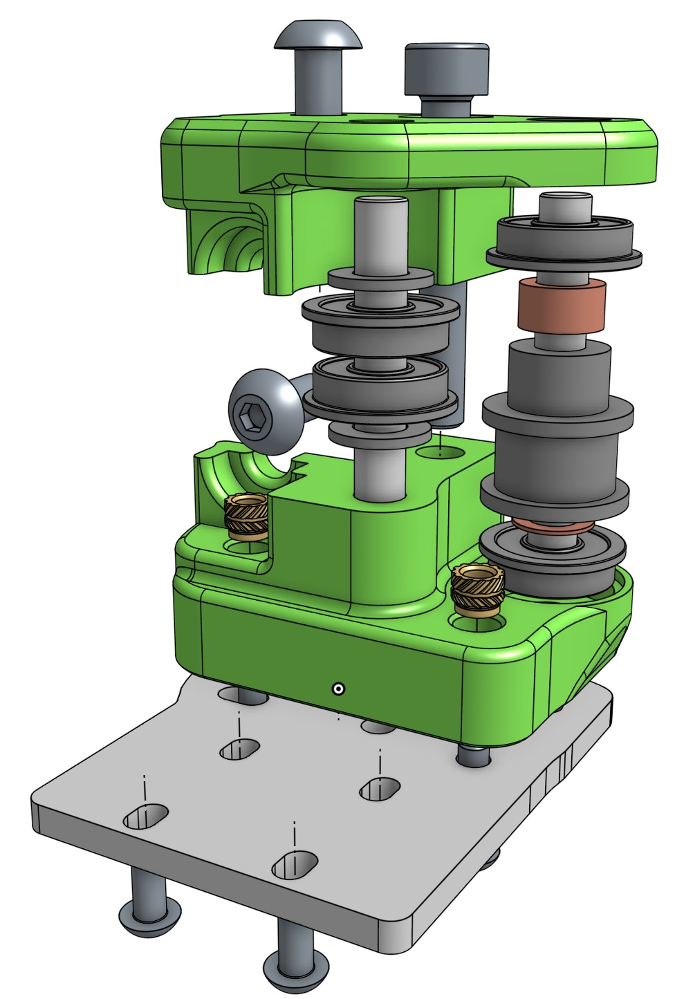
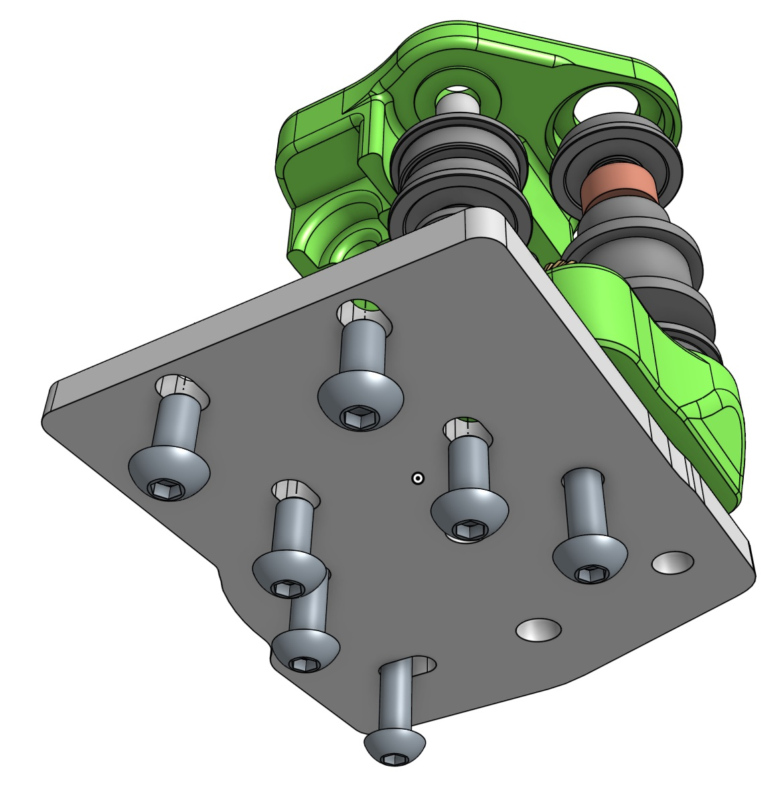

# Plated 2020 Trailhead assembly

## Bill of materials

| Amount | Part |
| ------ | ---- |
| 8 | F695 bearing |
| 2 | De-hubbed pulley or toothed idler |
| 4 | 5x7x1mm shim |
| 4 | 5x35mm G6 steel pins |
| 4 | M3 heatset insert |
| 4 | M5x10 BHCS |
| 2 | M5x35 SHCS |
| 8 | M3x6 BHCS |
| 2 | M3x12 BHCS |
| 4 | M3x16 BHCS |

> [!NOTE]
> It might be useful to design and print spacers between then toothed idler/dehubbed pulley to ensure that the F695 bearings stay in place.

## Assembly view

